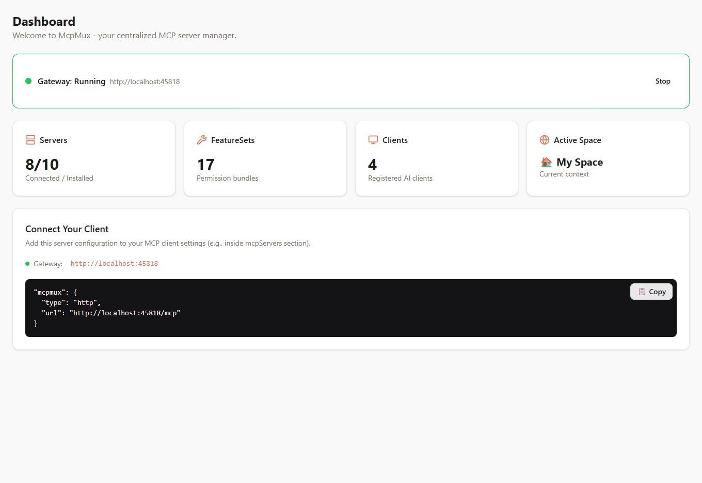
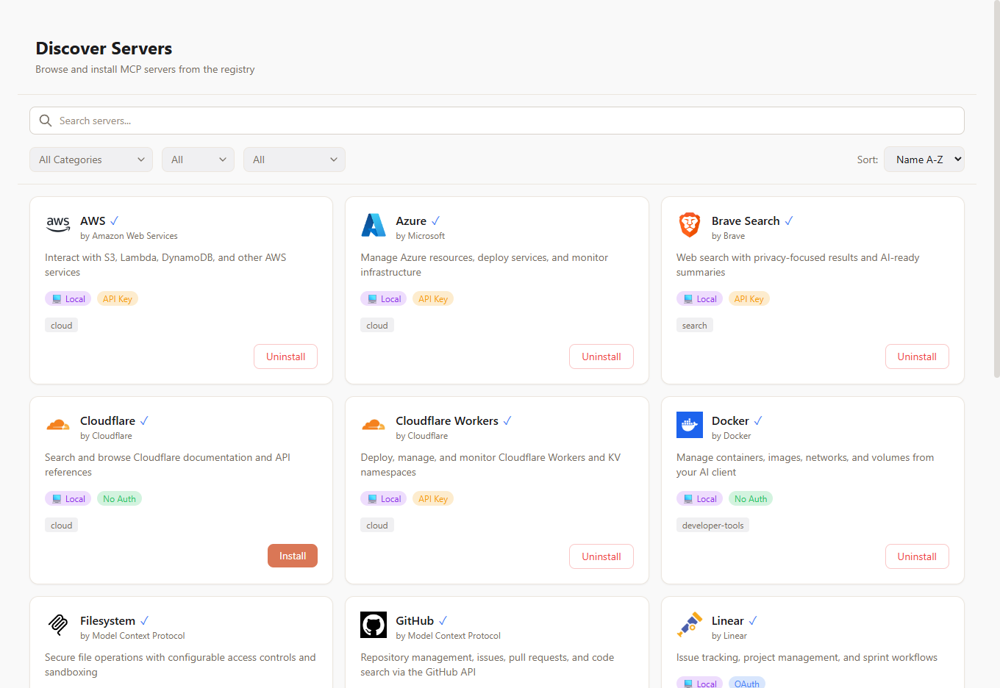
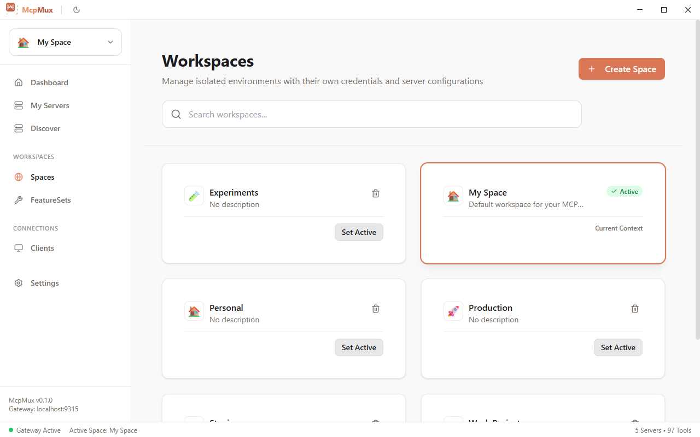
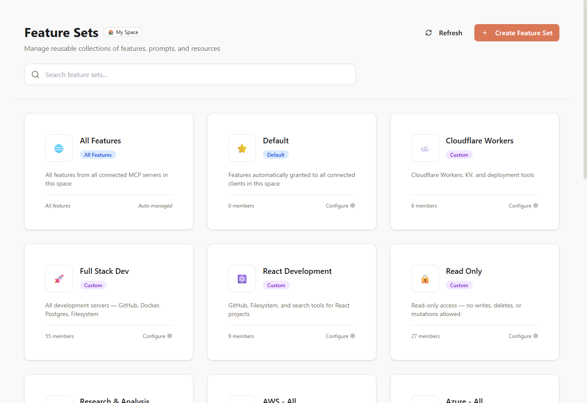
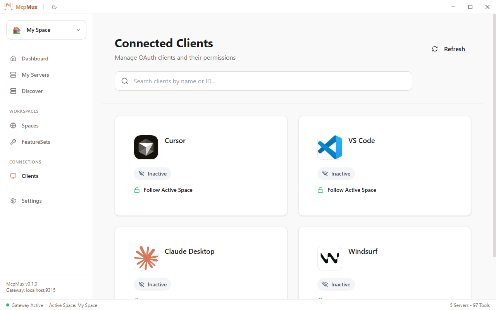
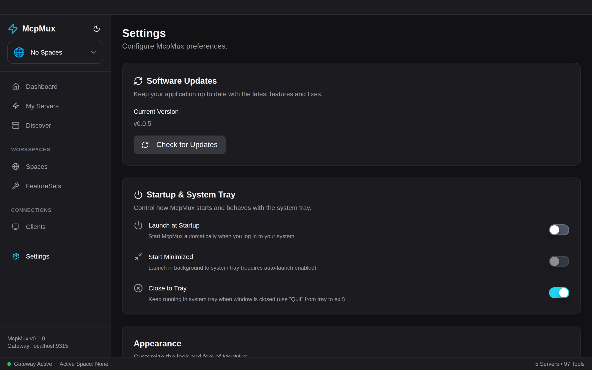

# McpMux

[](LICENSE)
[](https://github.com/MCP-Mux/mcp-mux/releases)

### Configure your MCP servers once. Connect every AI client.



---

## The Problem

Every AI client has its own MCP config file. Same servers, same credentials — duplicated everywhere.

```
Cursor          → config.json   → github, slack, db  + API keys
Claude Desktop  → config.json   → github, slack, db  + API keys  (again)
VS Code         → settings.json → github, slack, db  + API keys  (again)
Windsurf        → config.json   → github, slack, db  + API keys  (again)
```

Add a server? **Update every client.** Rotate an API key? **Update every client.** New project? **Reconfigure everything.**

And all those credentials? Sitting in **plain-text JSON files** on disk.

## The Fix

McpMux is a desktop app that runs a local gateway. Configure your servers once, point all clients to one URL.

```
Cursor          ─┐
Claude Desktop  ─┤──→  McpMux (localhost)  ──→  all your MCP servers
VS Code         ─┤     encrypted credentials
Windsurf        ─┘     one config, one place
```

Add a server in McpMux and every client has it instantly. No files to edit.

---

## How It Works

**1.** Install servers from the built-in registry (or add manually)

**2.** Paste one config into your AI clients:

```json
{
  "mcpServers": {
    "mcpmux": {
      "type": "http",
      "url": "http://localhost:45818/mcp"
    }
  }
}
```

**3.** Done. All tools from all servers are available in every client.

McpMux routes calls to the right server, refreshes OAuth tokens automatically, and keeps credentials encrypted in your OS keychain. You don't think about it.

---

## Features

### Server Management

Add, remove, and monitor all your MCP servers in one place. See connection status, auth type, and transport at a glance.


### Server Registry

Browse and one-click install from a curated registry of MCP servers. Filter by category, auth type, or hosting. Cached for offline use.



### Spaces

Isolated workspaces with their own servers and credentials. Switch between "Work" and "Personal" in one click — your AI clients follow automatically.



### Feature Sets

Control exactly which tools, prompts, and resources are available. Create custom permission bundles like "Read Only" or "Dev Tools" and assign them to clients.



### Connected Clients

See every AI client connected to your gateway. Manage OAuth registrations and control which space each client can access.



### Settings

Auto-updates, launch at startup, system tray, and appearance preferences.



---

## Security

MCP defaults to plain-text config files with raw API keys. McpMux replaces that with:

- **OS Keychain** — secrets in platform-native secure storage, not on disk
- **AES-256-GCM** — field-level database encryption
- **OAuth 2.1 + PKCE** — standard auth with automatic token refresh
- **Local-only gateway** — binds to `127.0.0.1`, nothing exposed to the network
- **Per-client access keys** — granular permissions per AI client
- **Sanitized logs** — tokens never appear in log files
- **Memory zeroization** — secrets wiped from memory after use

All MCP traffic stays on your machine. Cloud sync (optional) only covers config metadata — never credentials or payloads.

---

## Getting Started

**1. [Download McpMux](https://github.com/MCP-Mux/mcp-mux/releases)** — Windows (MSI), macOS (DMG), Linux (DEB/RPM/AppImage)

**2. Add servers** — Discover tab to browse the registry, or add manually

**3. Paste config** — Copy the snippet from the Dashboard into your AI clients

That's the last config file you'll need to touch.

---

## Development

```bash
pnpm setup    # First-time: install dependencies
pnpm dev      # Start development
pnpm build    # Production build
pnpm test     # Run all tests
```

**Prerequisites:** Rust 1.75+, Node.js 18+, pnpm 9+. Linux also needs `gnome-keyring libsecret-1-dev librsvg2-dev pkg-config`.

Built with **Tauri 2** (Rust + React 19), **Axum** for the gateway, **ring** for encryption, **rmcp** for MCP.

<details>
<summary>Project structure</summary>

```
mcp-mux/
├── apps/desktop/          # Tauri desktop app (React + Rust)
├── crates/
│   ├── mcpmux-core/       # Domain logic
│   ├── mcpmux-gateway/    # HTTP gateway, OAuth, routing
│   ├── mcpmux-storage/    # SQLite + encryption + OS keychain
│   └── mcpmux-mcp/        # MCP protocol
├── packages/ui/           # Shared UI components
└── tests/                 # Unit, integration, E2E tests
```

</details>

## Contributing

See [CONTRIBUTING.md](CONTRIBUTING.md) for guidelines.

## License

[GNU General Public License v3.0](LICENSE)
