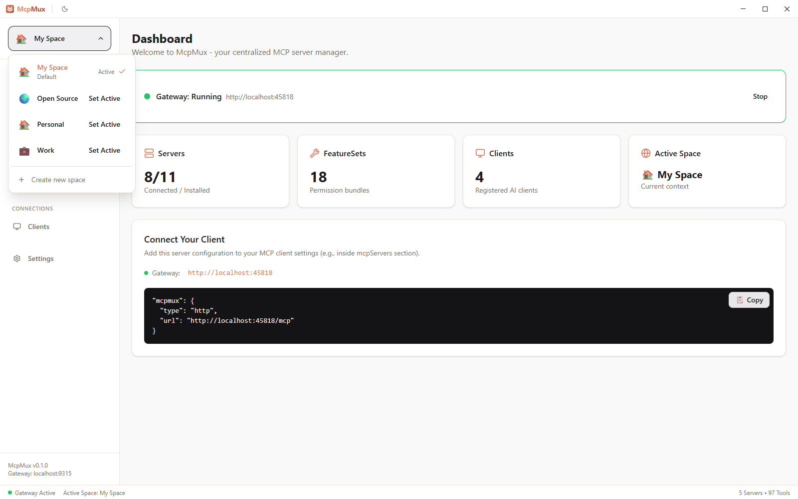
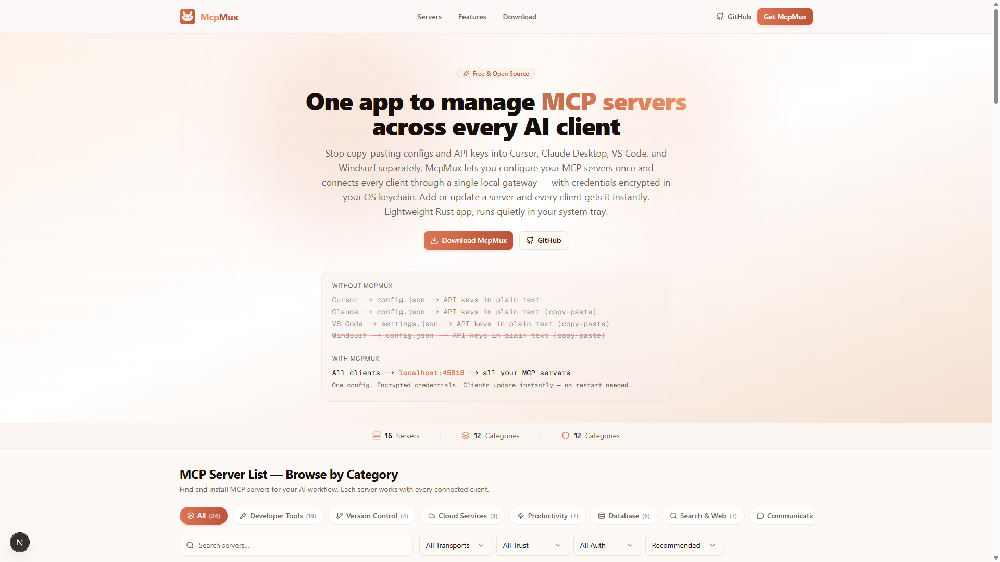
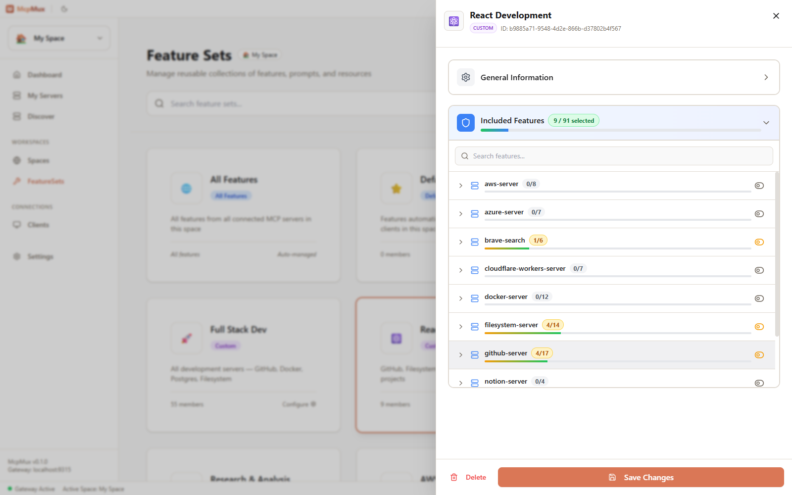
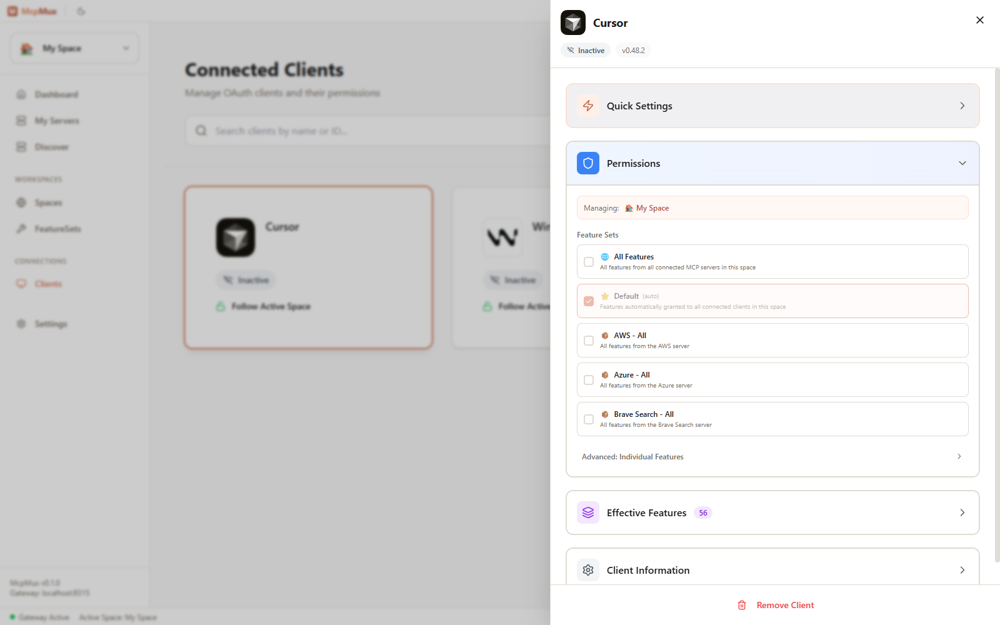

# McpMux

[](LICENSE)
[](https://github.com/mcpmux/mcp-mux/releases)

### Configure your MCP servers once. Connect every AI client.

**[Website](https://mcpmux.com)** · **[Download](https://mcpmux.com/download)** · **[Discover Servers](https://mcpmux.com)** · **[Features](https://mcpmux.com/features)**



---

## The Problem

You use Cursor, Claude Code, VS Code, and Windsurf. They all support MCP. But every client has its own config file — and none of them talk to each other.

```
Cursor          → config.json   → github, slack, db  + API keys
Claude Code     → config.json   → github, slack, db  + API keys  (copy-paste)
VS Code         → settings.json → github, slack, db  + API keys  (copy-paste)
Windsurf        → config.json   → github, slack, db  + API keys  (copy-paste)
```

Add a server? **Edit four files.** Rotate an API key? **Edit four files.** New teammate, new machine, new project? **Start from scratch.**

And those API keys? Sitting in **plain-text JSON files** anyone can read.

## The Fix

McpMux is a desktop app that runs a local MCP gateway. You configure servers once — every AI client connects to the same URL.

```
Cursor          ─┐
Claude Code     ─┤──→  McpMux (localhost:45818)  ──→  all your MCP servers
VS Code         ─┤     encrypted credentials
Windsurf        ─┘     one config, one place
```

Add a server in McpMux and it appears in Cursor, Claude, VS Code, and Windsurf instantly. No files to edit. No credentials to copy.

---

## How It Works

**1.** Install servers from the built-in registry — or add your own

**2.** Paste one config into each AI client (the last config you'll ever need):

```json
{
  "mcpServers": {
    "mcpmux": {
      "type": "http",
      "url": "http://localhost:45818/mcp"
    }
  }
}
```

**3.** Done. Every tool from every server is available in every client, right now.

McpMux routes calls to the right server, refreshes OAuth tokens automatically, and keeps credentials encrypted in your OS keychain — you never think about it again.

---

## Features

### All Your Servers, One Place

No more duplicating server configs across Cursor, Claude, VS Code, and Windsurf. Install a server in McpMux and it's immediately available everywhere. Expand any server to inspect its tools, prompts, and resources. See live connection status. OAuth tokens refresh automatically in the background.


### 100+ Servers, One Click

Stop hunting for MCP server repos and hand-writing transport configs. Browse a curated registry of 100+ servers — GitHub, Slack, PostgreSQL, Docker, Notion, AWS, Azure, and more. Click install, enter your credentials, and the server is live across every AI client you use. You can also browse the full registry at [mcpmux.com](https://mcpmux.com).


The full registry is also available on the web at [mcpmux.com](https://mcpmux.com) — with search, categories, and one-click install via deep links.



### Workspaces That Keep Things Separate

Create isolated Spaces — each with their own servers, credentials, and permissions. A "Work" space for company databases and internal APIs. A "Personal" space for side projects. Switch in one click from the sidebar and every connected AI client follows automatically. No more accidentally querying your personal database from a work project.


### Control What Each Client Can Do

Not every AI client should have the same power. Create Feature Sets — permission bundles that control exactly which tools, prompts, and resources a client can access. Build a "Read Only" set for cautious workflows, a "React Development" set with just GitHub and Filesystem, or a "Full Stack Dev" set with everything. Assign them per-client so each tool only goes where you want it.



### See and Manage Every Connected Client

Cursor, VS Code, Windsurf, Claude Code — see every AI client connected to your gateway in real time. Click any client to manage its workspace, grant or revoke feature sets, and see exactly which tools it can access. New clients authenticate via OAuth with a one-click approval flow.



---

## Security

MCP defaults to plain-text config files with raw API keys. McpMux replaces that with defense in depth:

- **OS Keychain** — secrets in platform-native secure storage (DPAPI on Windows, Keychain on macOS, libsecret on Linux), never in plain-text files
- **AES-256-GCM** — field-level database encryption for all sensitive data
- **OAuth 2.1 + PKCE** — standard auth flow with automatic token refresh
- **Local-only gateway** — binds to `127.0.0.1`, nothing exposed to the network
- **Per-client access keys** — each AI client authenticates independently with granular permissions
- **Sanitized logs** — tokens and secrets never appear in log output
- **Memory zeroization** — secrets wiped from memory after use via `zeroize`

All MCP traffic stays on your machine. Cloud sync (optional, coming soon) only covers config metadata — never credentials or payloads.

---

## Getting Started

**1. [Download McpMux](https://mcpmux.com/download)** — Windows, macOS, Linux

**2. Add servers** — use the Discover tab to browse 100+ servers, or [explore servers on mcpmux.com](https://mcpmux.com) and install with one click

**3. Paste the config** — copy the snippet from the Dashboard into your AI clients

That's the last config file you'll ever touch.

> **Linux quick install:** `curl -fsSL https://install.mcpmux.com | bash`
>
> **macOS via Homebrew:** `brew install --cask mcpmux/tap/mcpmux`
>
> See [mcpmux.com/download](https://mcpmux.com/download) for all platforms and install methods.

---

## Install on Linux

**Quick install** (detects your distro automatically):
```bash
curl -fsSL https://install.mcpmux.com | bash
```

<details>
<summary>Other install methods</summary>

**Debian / Ubuntu** (APT repository for automatic updates):
```bash
curl -fsSL https://install.mcpmux.com/apt | sudo bash
```

**Fedora / RHEL** (from GitHub Releases):
```bash
# Download the latest .rpm
sudo dnf install https://github.com/mcpmux/mcp-mux/releases/latest/download/mcpmux-0.0.12-1.amd64.rpm
```

**Arch Linux** (AUR):
```bash
yay -S mcpmux-bin
```

**AppImage** (any distro):
```bash
curl -fsSL https://install.mcpmux.com | bash  # auto-detects, falls back to AppImage
```

Or download directly from [GitHub Releases](https://github.com/mcpmux/mcp-mux/releases/latest).

</details>

---

## Development

```bash
pnpm setup    # First-time: install dependencies
pnpm dev      # Start development
pnpm build    # Production build
pnpm test     # Run all tests
```

**Prerequisites:** Rust 1.75+, Node.js 18+, pnpm 9+. Linux also needs `gnome-keyring libsecret-1-dev librsvg2-dev pkg-config`.

Built with **Tauri 2** (Rust + React 19), **Axum** for the gateway, **ring** for encryption, **rmcp** for MCP.

<details>
<summary>Project structure</summary>

```
mcp-mux/
├── apps/desktop/          # Tauri desktop app (React + Rust)
├── crates/
│   ├── mcpmux-core/       # Domain logic
│   ├── mcpmux-gateway/    # HTTP gateway, OAuth, routing
│   ├── mcpmux-storage/    # SQLite + encryption + OS keychain
│   └── mcpmux-mcp/        # MCP protocol
├── packages/ui/           # Shared UI components
└── tests/                 # Unit, integration, E2E tests
```

</details>

## Links

- **Website & Server Discovery** — [mcpmux.com](https://mcpmux.com)
- **Download** — [mcpmux.com/download](https://mcpmux.com/download)
- **Features** — [mcpmux.com/features](https://mcpmux.com/features)
- **Server Definitions Repo** — [github.com/mcpmux/mcp-servers](https://github.com/mcpmux/mcp-servers)

## Contributing

See [CONTRIBUTING.md](CONTRIBUTING.md) for guidelines.

## License

[GNU General Public License v3.0](LICENSE)
