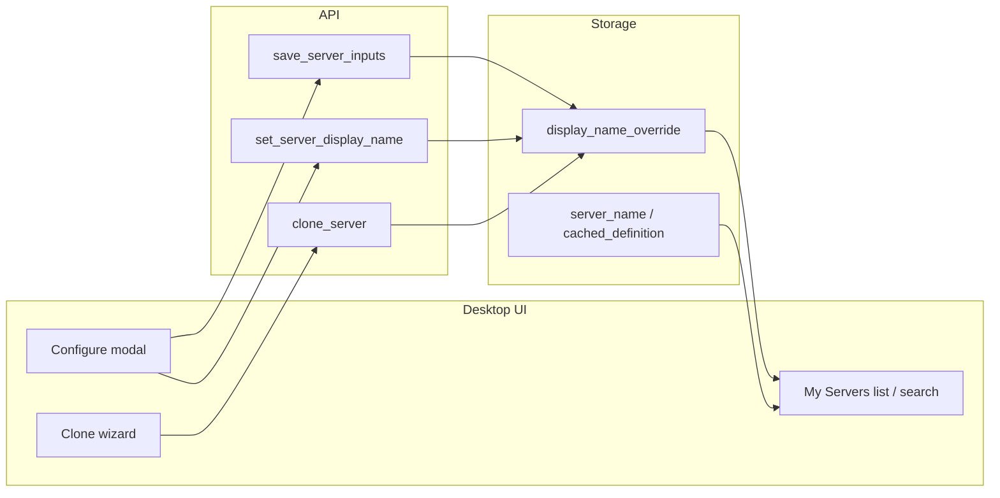

# Server Display Rename

**Last Updated:** May 25, 2026
**Status:** Complete — Phases 1–4 shipped
**Branch:** `feat/server-account-clones` (continuation of clone work)
**Base branch:** `main`
**Depends on:** [Server Account Clones](server-account-clones.md) (Phase 1–4 shipped)
**Unblocks:** Multi-account UX — distinguishing two installs of the same MCP (e.g. two Google Calendars) without renaming `server_id`

---

## Problem

Once a Space has multiple installs of the same MCP — either via the clone wizard or a hand-edited user-config JSON — the only thing telling them apart in the UI is the cached definition name (`Google Calendar`, `Google Calendar (work)`). That string lives on `cached_definition` and `server_name`, both of which the user cannot edit and both of which `user_space_sync` overwrites on every config sync.

Users want a friendly per-install label that:

- They can edit any time, not just at clone time.
- Survives later definition refreshes (registry pulls, user-config sync).
- Does not affect routing — `server_id`, alias, or tool prefixes stay locked once chosen, otherwise existing tool names break.

---

## Decisions

| # | Decision | Choice | Rationale |
| - | -------- | ------ | --------- |
| 1 | Identity vs label | **Display label only now**; `server_id` / alias / tool prefixes unchanged | Renaming the ID would invalidate every prompt, binding, and tool name referencing the server. Labels are reversible; IDs are not. |
| 2 | Storage shape | New nullable `display_name_override` column on `installed_servers` (migration 018) | `server_name` is overwritten on every user-config sync, so the override needs its own column to survive. |
| 3 | Eligible installs | Registry, manual, clones, and user-config installs are all renamable | Users want to label *any* install — not just clones. |
| 4 | Uniqueness | Duplicate display names allowed in a space | The `server_id` is already unique; labels are pure UX. |
| 5 | Configure surface | Display name field at top of the Configure modal, with helper text "Shown in My Servers only. Does not change the server ID or tool names." | Single place users already go to edit a server. |
| 6 | Clone wizard | Optional freeform display name + existing suffix (suffix still drives `server_id` / alias) | Lets users pick a friendly name at clone time without giving up suffix-driven routing. |
| 7 | Always-show Configure | Action menu shows Configure (renamed to "Settings" when there are no inputs) for every installed server | Servers without credential inputs still need a way to be renamed. |
| 8 | Meta-tool surfacing | `mcpmux_list_servers` reports the effective display name (override → `server_name` → `server_id` tail) | Agents see "Joe Calendar" instead of the catalog name when the user has renamed an install. |

---

## The Model



`InstalledServer::display_name()` is the single source of truth for the effective label:

```rust
override
  .or(server_name)
  .or(server_id.split('/').last())
```

The frontend `resolveInstalledDisplayName` mirrors that precedence so every code path agrees on what to render.

---

## File Inventory

### Phase 1 — Storage and domain (✅)

- `crates/mcpmux-storage/src/migrations/018_installed_server_display_name_override.sql` — new column.
- `crates/mcpmux-storage/src/database.rs` — register migration 018.
- `crates/mcpmux-core/src/domain/installed_server.rs` — `display_name_override` field, `display_name()` precedence, `with_display_name_override` helper, unit tests.
- `crates/mcpmux-storage/src/repositories/installed_server_repository.rs` — INSERT/UPDATE/SELECT round-trip and `set_display_name_override`.
- `crates/mcpmux-core/src/repository/mod.rs` — trait method `set_display_name_override`.
- `tests/rust/src/mocks.rs` — mock repo impl.

### Phase 2 — Application service and Tauri (✅)

- `crates/mcpmux-core/src/application/server.rs` — `clone_server` accepts optional `display_name_override`; `update_config` accepts optional `display_name_override` (None = leave alone, Some(empty) = clear, Some(value) = set); new `set_display_name_override` service method; unit tests covering set/clear via update_config and the dedicated method, plus clone-with-display-name.
- `apps/desktop/src-tauri/src/commands/server.rs` — `save_server_inputs` extended with `display_name_override`; new `set_server_display_name` command.
- `apps/desktop/src-tauri/src/commands/server_clone.rs` — `clone_server` extended with optional `display_name`.
- `apps/desktop/src-tauri/src/lib.rs` — register `set_server_display_name`.

### Phase 3 — Frontend (✅)

- `apps/desktop/src/types/registry.ts` — `display_name_override` on `InstalledServerState`.
- `apps/desktop/src/features/servers/server-display-name.helpers.ts` — new `resolveInstalledDisplayName` helper.
- `apps/desktop/src/features/servers/ServersPage.tsx` — view-model merge paths (`mergeDefinitionsWithStates`, `createOfflineServerViewModel`, `createViewModelFromClone`) use the helper; `ConfigModalState` carries `displayName` / `initialDisplayName`; modal seeds and persists the field via `saveServerInputs`.
- `apps/desktop/src/features/servers/ServerActionMenu.tsx` — Configure action always shown ("Settings" when no inputs).
- `apps/desktop/src/features/servers/CloneAccountModal.tsx` — optional Display name field, defaults to `{Source} ({suffix})` placeholder, sent to `clone_server`.
- `apps/desktop/src/features/servers/UninstallSourceWithClonesDialog.tsx` — dependent labels resolved through the helper.
- `apps/desktop/src/lib/api/registry.ts` — extended `saveServerInputs`; new `setServerDisplayName`.
- `apps/desktop/src/lib/api/serverClone.ts` — `cloneServer` accepts `displayName`.
- `apps/desktop/src/stores/registryStore.ts` — `mergeServers` uses the helper for installed rows.

### Phase 4 — Meta tools (✅)

- `crates/mcpmux-gateway/src/services/meta_tools/tools.rs` — `mcpmux_list_servers` builds `server_id → InstalledServer.display_name()` lookup and prefers it over feature-derived names.

---

## Out of scope

- Changing `server_id`, clone suffix, or tool prefix (`alias_*`) via rename UI.
- Phase 5 "first-class instances" (`instance_label` schema) from [server-account-clones.md](server-account-clones.md).
- Syncing the override back into user-space JSON `label` field (future enhancement).

## Risks and mitigations

| Risk | Mitigation |
|------|------------|
| UI still shows catalog name in some surface | Centralized `resolveInstalledDisplayName` + every merge path fixed |
| User-config sync clobbers the label | `display_name_override` lives in its own column; sync only refreshes `server_name` / `cached_definition` |
| Configure unreachable for no-input servers | Action menu always shows Configure (renamed to "Settings") |
| Tool names break after rename | Rename only updates the label; `server_id` and alias are immutable in v1 |

## Validation

- `cargo nextest run -p mcpmux-core -p mcpmux-storage` — all tests including new override coverage pass.
- `cargo nextest run -p tests --test integration server_clone` — clone integration tests still pass with the new parameter.
- `pnpm typecheck` — passes.
- `pnpm validate` should be re-run before merge for full clippy + ESLint + formatting coverage.
